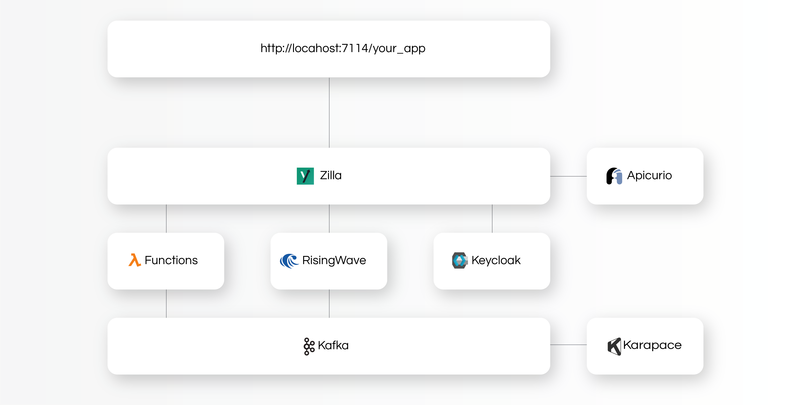

<div align="center">
  
</div>

# Zillabase

Zillabase is a Firebase alternative re-imagined for real-time data and asynchronous workloads. It combines a stack of streaming-native open-source tools to automatically generate an event-driven backend, complete with real-time data models, user functions, security, and APIs (both RESTFul and Async ones).

## How it Works

Event-driven architectures and real-time data streaming can be daunting, especially for application developers. Zillabase brings a Firebase-like experience to event-driven development by abstracting away complexity through `SQL` and automatically generated `AsyncAPIs`. 

**The high-level Zillabase user-flow is:**

1) Define your data model with `SQL`

2) Zillabase automatically generates `REST` and `SSE` (Server Sent Events) APIs 

3) Add business logic via user-defined Java or Python `functions`

4) Add authentication via `OAuth 2.0` and `JWTs`
  
While Zillabase relies on `SQL` for data modeling, there is no actual `SQL` database present in the stack. Instead, Zillabase maintains materialized views and tables in `Apache Kafka`. From the outside, Zillabase looks and behaves like a `Postgres` database, under the covers though, all data is persisted as streams across Kafka topics. This makes Zillabase asynchronous, highly responsive, and ready for real-time data processing.

### Architecture

<div align="center">
  
</div>

Zillabase is a combination of open-source tools and runs via docker compose.

* [Zilla](https://github.com/aklivity/zilla) is a multi-protocol edge and service proxy that turns Kafka streams into APIs

* [Apache Kafka](https://github.com/apache/kafka) is a data streaming system used for data persistence and integration

* [RisingWave](https://github.com/risingwavelabs/risingwave) is a SQL-based stream processing engine used to configure Apache Kafka and execute functions

* [Keycloak](https://github.com/keycloak/keycloak) is used for identity and access management

* [Apicurio](https://github.com/Apicurio/apicurio-registry) is an API registry used for storing generated Zillabase AsyncAPIs

* [Karapace](https://github.com/Aiven-Open/karapace) is a schema registry used for storing Kafka schemas

## Getting Started

### Install and launch

```
    brew tap aklivity/tap 
    brew install zillabase

    # list all zillabase commands
    zillabase

    # launch zillabase
    zillabase start

    # teardown zillabase
    zillabase stop
```

### Building your first app

Zillabase documentation is in the works. In the meantime, the `examples` directory includes two sample Zillabase applications that can be used as scaffolding for your first application. 

1) [StreamPayAI](https://github.com/aklivity/zillabase/tree/develop/examples/streampay): A Venmo-like payment application with real-time AI-powered fraud detection

2) [PetStore](https://github.com/aklivity/zillabase/tree/develop/examples/petstore): The quintessential OpenAPI/Swagger Petstore demo, but fully event-driven

## Join the Community

Star the repo and watch "releases" to get notified of major updates. Engage in technical discussions, ask questions, and meet other users in the [Aklivity Slack Community](https://github.com/aklivity/zilla/blob/develop/LICENSE-AklivityCommunity).
