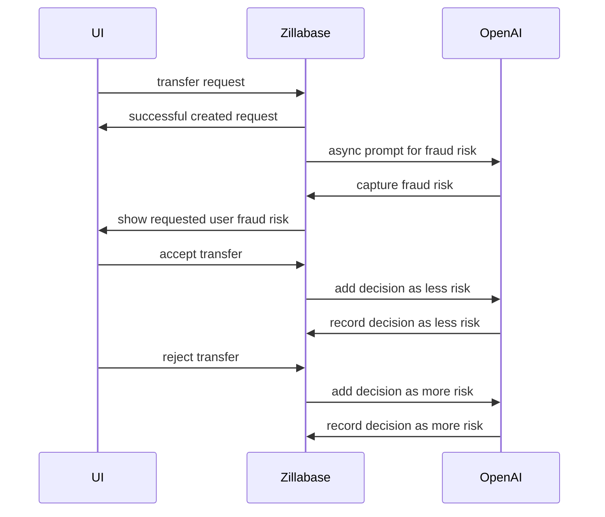

[https://cookbook.openai.com/examples/question_answering_using_embeddings]()

````
Incoming transaction: Allen transfer $3400 to Bertollo

==== Open AI Query ====

Use the below collection of safe and risky money transfer requests to answer the subsequent question along with your own opinion.

Collection:
"""
Allen transferring $3200 to Bertollo is risky
Allen transferring $3400 to Fred is safe
Allen transferring $3900 to Greg is safe
Allen transferring $2800 to Candice is safe
Elaine transferring $4300 to Bertollo is safe
"""

Question: Should Allen transfer $3400 to Bertollo?

==== Open AI Result ====

```json
{
  "summary": "Based on the previous data, Allen transferring money to Bertollo has been identified as risky in one instance. Although Allen has made safe transfers to others, the specific transfer to Bertollo raises concerns. Therefore, it is advisable to consider the risk before proceeding.",
  "risk": 70
}
```
````
