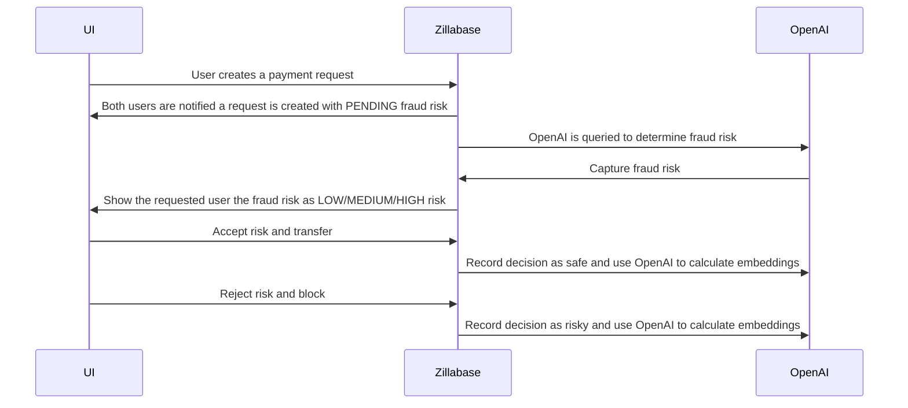

# Zillabase Streampay

This is an implementation of the Streampay App designed to transfer payments from one user to another.
Zilla is implementing the REST endpoints defined in an AsyncAPI 3.x spec and proxying them onto Kafka topics defined in an AsyncAPI 3.x spec based on the operations defined in each spec.

Both HTTP AsyncAPI 3.x spec & Kafka AsyncAPI 3.x spec are generated automatically based on the Kafka Cluster metadata information.

## Install `zillabase`

```bash
brew tap aklivity/tap

brew install zillabase
```

## Start `zillabase` stack

```bash
zillabase start
```

Output:

```text
latest: Pulling from aklivity/zillabase
...
seed.sql processed successfully!
...
Realm: zillabase created successfully.
...
Config Server is populated with zilla.yaml
```

## Using the Streampay APIs

The Zillabase Streampay is exposes common entity CRUD endpoints with the entity data being stored on Kafka topics if Kafka's cleanup.policy=compact otherwise it exposes only Read mode endpoints.

### Endpoints that is used to build the app

Zillabase leverages the AsyncAPI schema definitions to define all of the generated streaming APIs. You can create an `asyncapi.yaml` schema file by running this zillabase command:

```bash
zillabase asyncapi list --id 2 >> asyncapi_REST_APIs.yaml
```

Once you have started zillabase and generated your AsyncAPI schema, you can copy it into the [AsyncAPI Studio](https://studio.asyncapi.com/) to get a full picture of all of the streaming APIs you have created.

Some of the endpoints described are:

| Method | Endpoint                           | Topic                          | Description                                  |
| ------ | ---------------------------------- | ------------------------------ | -------------------------------------------- |
| POST   | /streampay_users                   | dev.streampay_users            | Create an user.                              |
| PUT    | /streampay_users/{id}              | dev.streampay_users            | Update user by the key.                      |
| GET    | /streampay_users                   | dev.streampay_users            | Fetch all users.                             |
| GET    | /streampay_users/{id}              | dev.streampay_users            | Fetch user by the key.                       |
| GET    | /streampay_balances-stream         | dev.streampay_balances         | Stream latest user's balance.                |
| POST   | /streampay_commands                | dev.streampay_commands         | Post command such as payment request or pay. |
| GET    | /streampay_payment_requests        | dev.streampay_payment_requests | Fetch all payment requests.                  |
| GET    | /streampay_payment_requests/{id}   | dev.streampay_payment_requests | Fetch payment request by key.                |
| GET    | /streampay_payment_requests-stream | dev.streampay_payment_requests | Stream new available payment request.        |
| GET    | /streampay_activities-stream       | dev.streampay_activities       | Stream all the activities.                   |

## Setup StreamPay UI

### Install the dependencies

```bash
yarn
# or
npm install
```

### Start the app in development mode (hot-code reloading, error reporting, etc.)

```bash
quasar dev
```

Note: You can install quasar via `npm install -g @quasar/cli,` and you might need to execute `rehash` to find `quasar` on the path afterward.

### Login

Login using Keycloak with one of the users pre-created in [zillabase/config.yaml](./zillabase/config.yaml).

```yaml
keycloak:
  realm: zillabase
  users:
 - username: allen
      email: allen.doe@example.com
      name: Allen Doe
      password: Test@123
```

You can log in from a different browser session to one of the other users to see how money is sent between them

### Send Money

Once logged in, users should have a starting balance of money. You can:

- `SEND OR REQUEST` funds to any of the other users. Ideally, you can send or request to a second User you are logged in as.
- `Sending` money will immediately move money to the other user.
- `Requesting` money will send a transaction request to that user.

### Transfer Requests

A user with a transfer request is given the option to `Approve` or `Reject` the request. You can:

- `Approve` the payment. The money will be transferred to the requesting user.
- `Reject` the payment. The request will be removed from the list and marked as rejected.
- Wait for the OpenAI fraud check to finish to determine the potential fraud risk. You need to setup up the [OpenAI integration](#configure-streampay-openai-integration).

## Configure StreamPay OpenAI integration

To enable the OpenAI fraud detection integration, you must [create an `OPENAI_API_KEY`](https://platform.openai.com/api-keys) and add it to your [zillabase/config.yaml](./zillabase/config.yaml).

```yaml
udf:
  python:
    env:
 - OPENAI_API_KEY=<your OpenAI API key>
```

### OpenAI Fraud Risk with Zillabase

By leveraging the existing CQRS event stream in Zillabase that the Streampay app uses, we can create OpenAI query functions using the Python OpenAI library.



When a new transaction request from Allen to transfer $3400 to Bertollo is created, the OpenAI query will be something similar to the following:

```text
==== Open AI Query ====

Use the below collection of safe and risky money transfer requests to answer the subsequent question along with your own opinion.

Collection:
"""
Allen transferring $3200 to Bertollo is risky
Allen transferring $3400 to Fred is safe
Allen transferring $3900 to Greg is safe
Allen transferring $2800 to Candice is safe
Elaine transferring $4300 to Bertollo is safe
"""

Question: Should Allen transfer $3400 to Bertollo?

==== Open AI Result ====

{
 "summary": "Based on the previous data, Allen transferring money to Bertollo has been identified as risky in one instance. Although Allen has made safe transfers to others, the specific transfer to Bertollo raises concerns. Therefore, it is advisable to consider the risk before proceeding.",
 "risk": "MEDIUM"
}
```

This system prompt is used:

```text
You recommend the amount of fraud risk for money transfers between two people and respond only with a JSON object containing your summary and a numeric value of the risk as LOW, MEDIUM, or HIGH. Only return valid JSON string and no other markup.
```

You can find the Python functions used in the [zillabase/functions/python/fraud_check.py](./zillabase/functions/python/fraud_check.py) file

## Stop `zillabase` stack

```bash
zillabase stop
```
